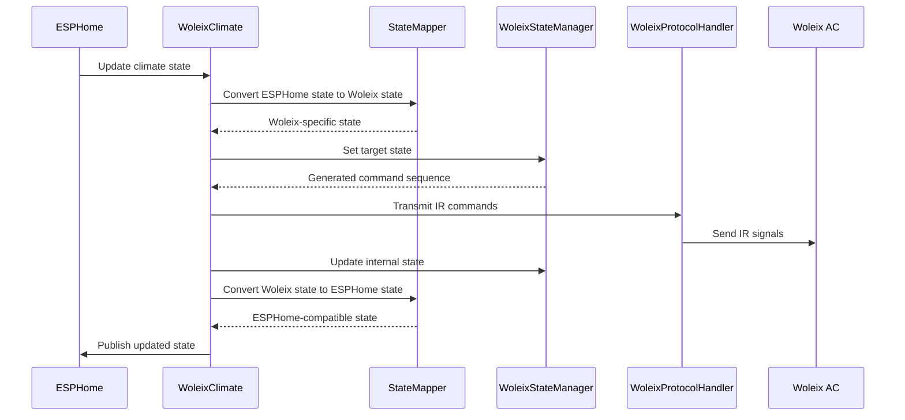
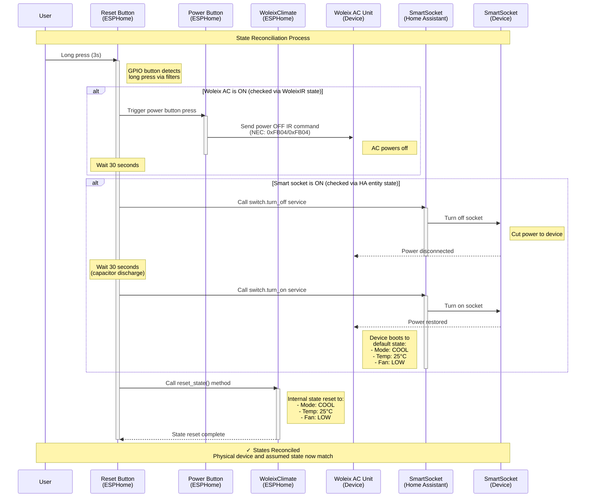

# ESPHome External Components - Woleix Climate IR

Custom ESPHome component for controlling Woleix air conditioners via infrared remote control.

## The Goals

My original goal was to automate a portable AC I bought to cool a new room. What started as a quick project expanded into a learning exercise. With the time, the list of goals has been extended:

- Automate the Woleix AC via ESPHome/HA
- Learn the new standards of C++ (as I programmed C++ last time around 2003)
- Create a base for myself in case I want to create some other ESPHome external component (I have quite a couple of ESP8266/ESP32 lying around, so the chances are high)
- Try out vibe coding (results below) :)

This goal extension is the main reason for some overengineering that you will find in the code, I just wanted to try out things. Feel free to simplify them as much as you want if you take the code as a basis ;).

## The Approach

I love unit testing with good coverage and an ability to debug things that go wrong. So, my goal was to come out with an approach (a process and tools) that let me do things locally as much as I can.

Roughly, I maintain the latest state of ESPHome/PlatformIO as a compilation basis (core, components, libraries) and use it to build the project locally. After that I apply a set of unit tests to verify the internal logic of the implementation. 

If everything goes fine, I whether the test configs compile inside an ESPHome container.

If ok, I judge the firmware as production-ready and flash.

## The Tools

I wanted a toolset that lets me do heavy lifting locally, without flashing the firmware every time. To achieve that I use `GTest` and `GMock`. Tons of magic happens in `CMake` as well.

Be aware: the price for that is proper mocking. The header files and the entities themselves are heavily mocked. On the one hand, it is in the nature of unit tests, on the other hand it is additional (and not very small) effort.

Well, I resolved this tradeoff as I resolved, and that's the result.

Another aspect of tooling is portability. I have two laptops: a MacBook Pro and a Windows-based ASUS.

On the ASUS I run WSL2 and do compilation there. I do not use native Windows for development. Getting C++ toolchains there is a pain wherever and I just did not want to go through this. So, MacOS and WSL are supported, Windows not.

## Design Decisions

Below is a pure technical description, up to 80% vibe coded (generated based on the code state). But here I would like to share some fundamental things that may be necessary to understand the design.

### Design Challenge: Synchronous ESPHome, asynchronous Woleix AC IR

I recognized early that the IR control protocol of the Woleix is somehow unusual. Even when just playing around with the native remote, I found out that (strangely enough) the first press of `Temp+` or `Temp-` button does not change the temperature, it just lets the LED panel blinking and only subsequent presses make the temperature updates, but only if they take place while the LED is blinking, i.e. within 5 seconds. It is a protocol quirk, which requires asynchronicity.

At the same time, ESPHome `ClimateIR` itself is completely synchronous and optimistic. It pushes the state change (mode, temperature etc.) and does not care about switching the actual physical device, assuming optimistically that it eventually will reach the state. 

### Design Decision: Command Queue

Not really a completely unusual decision -- I decoupled the synchronous and asynchronous worlds by a queue. The `Climate` part fills in the queue synchronously, the `Protocol Handler` shovels it out respecting the IR protocol (delays etc.)

### Design Challenge: State Management

Well, this led to another question. In the beginning, I managed the internal Woleix AC state in a `State Manager` that also calculated the IR command chain (transitions in a state machine) that moved from the current state to the target state. Looking at the protocol quirk above, should this "Temperature setting" be state a part of the entire state machine (and has to be modeled in the `State Manager`), or not?

### Design Decision: Separate Device State from Protocol State

I decided to keep the logical state (mode, fan speed, temperature) in the `State Manager`, moving the temporal protocol quirks to the `Protocol Handler` (it is how it emerged, initially it was just a dumb transmitter translating logical commands to NEC represenation and sending over the air).

### Design Challenge: Polling vs. Observer

In general, it would be easier to implement stuff based on polling, e.g. the `Protocol Handler` looks into the `Command Queue` to get the next command to handle. But as ESPHome is normally single-threaded (that's at least my current understanding), polling is not an optimal solution.

### Design Decision: Observer is the Way

As you see in the code, I use `Observer` pretty much everywhere, from status reporting (well, this is a bit overengineered part) down to the command queue management.

### Design Challenge: State Reconciliation

Woleix AC IR does not support a back channel, so in the `ClimateIR` you do not know, whether the device is in the same state as your software thinks it is. Meaning, a state drift may happen.
The only way I found so far to reconcile is to cut off the power for some time, after which the device comes deterministically to a default state.

### Design Decision: External Button

So far I soldered an external button on the PCB, but it may be of course somewhere. The thing is, it should control a smart socket that connects the device to the power and switches it off for 30 sec to reconcile the state. A bad solution, I know, but the only one working for now. I have a couple of ideas on that, possibly they will be realized later. 

## Vibe Coding Results

I identified the following sweet spots for vibe coding in my projects:

- Unit tests generation
- Documenting the codebase
- Code review

I do not let LLMs mess with my productive coding, except for reviewing. The main problem of vibe coding agents (I use `Cline` with `Claude Sonnet 4.5`, but also earlier tried out `Github Co-pilot`) is their "fall-forward" approach. Even when made a wrong decision (which they do), they are not able to roll back, but try to make things working. The result is that the code is unmanageable after 4-5 iterations.

It can well be that I just was not able to come up with right prompts...

## 📁 Project Structure

```text
esphome-external-components/
├── esphome/
│   └── components/
│       └── climate_ir_woleix/              # Main component directory
│           ├── __init__.py                 # Python configuration interface
│           ├── climate.py                  # ESPHome climate platform
│           ├── climate_ir_woleix.h         # C++ header file
│           ├── climate_ir_woleix.cpp       # C++ implementation
│           ├── woleix_constants.h          # Constants definition
│           ├── woleix_state_manager.h      # State manager header
│           ├── woleix_state_manager.cpp    # State manager implementation
│           ├── woleix_state_mapper.h       # State mapper header
│           ├── woleix_state_mapper.cpp     # State mapper implementation
│           ├── woleix_protocol_handler.h   # Protocol handler header
│           ├── woleix_protocol_handler.cpp # Protocol handler implementation
│           └── LICENSE                     # Component license
├── tests/
│   ├── unit/                               # C++ unit tests
│   │   ├── climate_ir_woleix_test.cpp      # Climate component tests
│   │   ├── woleix_state_manager_test.cpp   # State manager tests
│   │   ├── woleix_state_mapper_test.cpp    # State mapper tests
│   │   ├── woleix_protocol_handler_test.cpp # Protocol handler tests
│   │   ├── CMakeLists.txt                  # Test build configuration
│   │   ├── run_tests.sh                    # Test execution script
│   │   ├── generate_coverage.sh            # Coverage report generator
│   │   ├── README.md                       # Unit testing documentation
│   │   └── mocks/                          # Mock ESPHome headers
│   ├── integration/                        # Integration tests
│   │   ├── test_configs/                   # ESPHome test configurations
│   │   ├── test_runner.py                  # Test orchestration script
│   │   ├── run_tests.sh                    # Integration test runner
│   │   ├── run_tests.py                    # Python test runner
│   │   ├── docker-compose.yml              # Docker environment
│   │   ├── Dockerfile                      # Docker configuration
│   │   └── README.md                       # Integration testing documentation
│   └── README.md                           # General testing documentation
├── .vscode/                                # VS Code configuration
├── CMakeLists.txt                          # Root CMake configuration
├── platformio_install_deps_locally.py      # PlatformIO dependency installer
├── prepare_esphome.sh                      # ESPHome setup helper script
├── requirements.txt                        # Python dependencies
├── .gitignore                              # Git ignore rules
├── .env.example                            # Example environment variables
└── README.md                               # This file
```

## 🛠️ Development Setup

### Prerequisites

- **Operating System**: macOS, Linux, or Windows with WSL
- **Git**: For version control
- **Python 3.9+**: For ESPHome development
- **C++ Compiler**: For building and testing
- **CMake 3.16+**: For build system
- **VS Code**: Recommended IDE

## 📖 Component Architecture

The climate_ir_woleix component consists of five main parts:

### 1. Climate IR Component (`climate_ir_woleix.h/cpp`)

- Implements ESPHome's Climate interface by extending ClimateIR
- Handles user interactions and overall state management
- Integrates with temperature/humidity sensors (temperature required, humidity optional)
- Coordinates IR command transmission using WoleixProtocolHandler
- Uses WoleixStateManager to manage state transitions and command generation
- Utilizes StateMapper for converting between ESPHome and Woleix-specific states

### 2. State Manager (`woleix_state_manager.h/cpp`)

- Manages internal AC state (power, mode, temperature, fan speed)
- Generates optimal command sequences for state transitions
- Handles mode cycling through COOL→DEHUM→FAN sequence
- Manages temperature adjustments (15-30°C in COOL mode)
- Uses WoleixCommandFactory to create IR commands
- Provides methods for state transitions and retrieving current state

### 3. Protocol Handler (`woleix_protocol_handler.h/cpp`)

- **WoleixCommand**: Represents individual IR commands using NEC protocol
  - Encapsulates command type, NEC address (0xFB04), delay, and repeat count
  - Supports POWER, TEMP_UP, TEMP_DOWN, MODE, and FAN_SPEED commands
- **WoleixProtocolHandler**: Handles IR transmission via ESPHome's RemoteTransmitterBase
  - Converts WoleixCommand objects to NEC protocol format
  - Manages command delays and repeats automatically

### 4. State Mapper (`woleix_state_mapper.h/cpp`)

- Provides bidirectional conversion between ESPHome and Woleix states
- Maps climate modes: COOL↔CLIMATE_MODE_COOL, DEHUM↔CLIMATE_MODE_DRY, FAN↔CLIMATE_MODE_FAN_ONLY
- Maps fan speeds: LOW↔CLIMATE_FAN_LOW, HIGH↔CLIMATE_FAN_HIGH
- Converts power states between boolean and enum representations

### 5. Constants (`woleix_constants.h`)

- Component version information
- Temperature limits (15-30°C)
- NEC protocol address (0xFB04)
- NEC command codes for all IR operations
- Default values for power, mode, temperature, and fan speed

### Interaction Between Components

The following sequence diagram illustrates the collaboration between the components:



This diagram shows how user interactions flow through the system, from ESPHome through the various components, resulting in IR commands being sent and the state being updated and published back to ESPHome.

**Key Features:**

- **IR Protocol**: Uses NEC protocol (address 0xFB04) for all IR transmissions
- **Power Control**: Power toggle with automatic state reset on power-on
- **Mode Cycling**: Circular mode sequence COOL → DEHUM → FAN → COOL
- **Temperature Control**: Adjustable 15-30°C in COOL mode with 1°C granularity
- **Fan Speed**: Toggle between LOW and HIGH speeds
- **Optimized Commands**: Generates minimal command sequences with appropriate delays
- **Granular Temperature**: Sends individual commands for each degree of temperature change
- **Sensor Integration**:
  - Temperature sensor (required) for current temperature display
  - Humidity sensor (optional) for current humidity display
- **State Reconciliation**: External reset button may be used for re-synchronizing with physical device state

**Temperature Control Behavior:**

The temperature control implementation sends multiple commands, one for each degree of change. This approach:

- Mimics the behavior of pressing a physical remote button multiple times
- Ensures compatibility with the AC unit's internal state tracking
- Allows for precise control and feedback
- Is consistent with the granular nature of temperature control compared to other binary or cyclic settings

**State Manager Behavior:**

- Power toggle affects all other states (turning ON resets to defaults)
- Mode cycles through COOL→DEHUM→FAN→COOL in sequence
- Temperature is only adjustable in COOL mode (15-30°C range)
- Fan speed toggles between LOW and HIGH

**Default Settings:**

- Power: ON
- Mode: COOL
- Temperature: 25°C
- Fan Speed: LOW

### 1. Clone the Repository

```bash
git clone https://github.com/ok11/esphome-external-components.git
cd esphome-external-components
```

### 2. Python Development Environment Setup

#### Create Virtual Environment

```bash
# Create .venv directory
python3 -m venv .venv

# Activate virtual environment
# On macOS/Linux/WSL:
source .venv/bin/activate

```

#### Install ESPHome

```bash
# Upgrade pip first
pip install --upgrade pip

# Install ESPHome and dependencies
pip install esphome

# Verify installation
esphome version
```

#### Configure VS Code Python Interpreter

1. Open Command Palette: `Cmd+Shift+P` (macOS) or `Ctrl+Shift+P` (Windows/Linux)
2. Type: `Python: Select Interpreter`
3. Choose: `.venv/bin/python` or `./esphome-external-components/.venv/bin/python`
4. Reload VS Code window if needed

### 3. C++ Development Environment Setup

#### Install Required Tools

**macOS:**

```bash
# Install Xcode Command Line Tools (includes clang/clang++)
xcode-select --install

# Install CMake via Homebrew
brew install cmake

# Install Google Test (optional, for local testing)
brew install googletest
```

**Linux (Ubuntu/Debian) or WSL:**

```bash
# Install build essentials
sudo apt update
sudo apt install build-essential cmake

# Install Google Test
sudo apt install libgtest-dev
cd /usr/src/gtest
sudo cmake CMakeLists.txt
sudo make
sudo cp lib/*.a /usr/lib
```

#### Verify C++ Tools

```bash
# Check compiler
g++ --version
# or
clang++ --version

# Check CMake
cmake --version

# Should see CMake 3.20 or higher
```

### 4. PlatformIO Dependencies (For External Component Development)

The `platformio_install_deps_locally.py` script installs PlatformIO libraries into the ESPHome installation directory, providing stable include and library paths for external component compilation. It is called from `prepare_esphome.sh` before `CMake` steps, so you basically don't bother, but it is of course also possible to call it separately.

#### Why Use This Script?

- **Stable Paths**: Unlike ESPHome's global `platformio_install_deps.py` (which installs to system-wide locations), this script installs dependencies under the ESPHome root directory
- **Predictable Includes**: Ensures consistent library locations for IDE IntelliSense and compilation
- **Development Workflow**: Essential for external component development where you need access to ESPHome's internal dependencies

#### Usage

```bash
# Activate virtual environment first
source .venv/bin/activate

# Install all dependencies from a platformio.ini file
./platformio_install_deps_locally.py /path/to/esphome/platformio.ini

# It is also possible to install packages separately (as opposed to the above "everything mentioned in the ini file")
#   -l, --libraries <list of libraries>  Install library dependencies
#   -p, --platforms <list of platforms>  Install platform dependencies
#   -t, --tools     <list of tools>      Install tool dependencies
```

### 5. Building and Testing C++ Code

#### Build Tests

```bash
# Create build directory
mkdir -p build
cd build

# Configure with CMake
cmake ..

# Build the tests
cmake --build .

# Run tests
ctest --output-on-failure

# Or run the test executable directly
./tests/climate_ir_woleix_test
```

#### Alternative: Use Test Script

```bash
# From project root
cd tests
./run_tests.sh
```

### 6. VS Code Configuration

The project includes pre-configured VS Code settings (I tried to keep it portable as much as possible):

- **`.vscode/settings.json`**: Python interpreter, CMake settings
- **`.vscode/tasks.json`**: Build tasks (Cmd+Shift+B)
- **`.vscode/launch.json`**: Debug configurations
- **`.vscode/c_cpp_properties.json`**: C++ IntelliSense configuration

#### Install Recommended VS Code Extensions

1. **Python** (ms-python.python)
2. **C/C++** (ms-vscode.cpptools)
3. **CMake Tools** (ms-vscode.cmake-tools)
4. **ESPHome Snippets** (optional)

## 🚀 Using the Component

### The Key Assumptions about the Hardware

In the essence, my hardware is a combination of

- (Required) **ESP32-C3 Super mini** for the entire control (very cheap on Aliexpress/Temu)
- (Required) An **IR Transmitter** to transmit towards the Woleix
- (Optional, but recommended) **DHT-11** (as the device is intended to be used indoor, DHT-22 measuring negative temperatures would be not required) for indicating current temperature and humidity
- (Optional, but recommended) A **button** component (grounded via a pull-up resistor of 220 Ohm) for reconciling the state

### On the State Reconciliation

Since Woleix has no back channel to the remote, the remote can only operate in "fire-and-forget" mode and must assume device state changes based on the commands it has sent. This state assumption (managed by the `woleix_ac_state_machine` in the component) can be easily broken if:

- IR signals are lost
- The native remote control is used
- Power interruptions occur
- ...

This leads to inconsistency between the assumed state and the actual device state. The Woleix offers no easy way to reset the device, except for:

1. Power off the device
2. Cut power for 30 seconds (to allow internal capacitors to discharge)

After powering on, the device returns to its *default* state:

- **Mode**: COOL
- **Temperature**: 25°C
- **Fan speed** (if then switched to FAN mode): LOW

To maintain synchronization, you need a mechanism to bring your WoleixIR component to the same *default* state. I have automated this at the Home Assistant level by controlling the device through a smart socket. The reconciliation process works as follows:

- An external reset button (a `binary_sensor`) is clicked (actually a long press of 3 seconds to avoid accidental resets), which initiates:
  - Sending a power OFF command to Woleix if it is currently on
  - After a 30-second delay (according to the user's manual), a Home Assistant automation switches off the smart socket
  - After another 30-second delay, the smart socket is powered back on
  - If the device was powered on before the reset, it is powered on again
  - The internal (assumed) state is reset to the defaults
- The states are now reconciled

#### Reconciliation Sequence Diagram



### In Your ESPHome Configuration

```yaml
external_components:
  - source: github://ok11/esphome-external-components
    components: [ climate_ir_woleix ]

# Remote transmitter setup
remote_transmitter:
  pin: GPIO20
  carrier_duty_percent: 50%
  id: ir_transmitter

# Temperature and humidity sensor
sensor:
  - platform: dht
    model: DHT11
    pin: GPIO4
    temperature:
      name: "Room Temperature"
      id: room_temp
    humidity:
      name: "Room Humidity"
      id: room_humidity
    update_interval: 60s

# Reset button
binary_sensor:
  - platform: gpio
    id: ac_reset_button
    pin: GPIO5
    filters:
      - delayed_on: 3s
      - delayed_off: 10ms
    on_press:
      ...

# Climate control
climate:
  - platform: climate_ir_woleix
    name: "Air Conditioner"
    transmitter_id: ir_transmitter
    sensor: room_temp              # Temperature sensor (required)
    humidity_sensor: room_humidity  # Humidity sensor (optional)
```

For a complete reset button automation example, see [a sample config](./config/woleix_climate.yaml).

## 🧪 Running Tests

### Unit Tests

#### Quick Start

```bash
# Build and run all tests
cd tests/unit
./run_tests.sh

# Generate coverage report
./generate_coverage.sh

# View coverage report
open build/coverage/html/index.html  # macOS
xdg-open build/coverage/html/index.html  # Linux
```

#### Current Test Status

As of the latest update, all unit tests in the test suite are passing:

- **28 tests** in `climate_ir_woleix_test.cpp` (Climate component tests)
- **26 tests** in `woleix_state_manager_test.cpp` (State manager tests)
- **19 tests** in `woleix_state_mapper_test.cpp` (State mapper tests)
- **12 tests** in `woleix_protocol_handler_test.cpp` (Protocol handler tests)

A total of 85 tests are now passing, with all previously reported issues resolved.

These tests cover:

1. **Temperature Control**: Verifying that temperature changes are only processed in COOL mode and that the correct number of temperature adjustment commands are sent.

2. **Mode Transitions**: Ensuring that mode changes (e.g., COOL to FAN, DRY to COOL) generate the correct number of mode change commands.

3. **Sensor Integration**: Confirming that temperature and humidity sensor updates are processed correctly and trigger state updates.

4. **Power State Transitions**: Validating the correct handling of power on/off sequences.

5. **Fan Speed Control**: Verifying proper fan speed adjustments across different modes.

6. **Complex State Changes**: Testing scenarios involving multiple parameter changes simultaneously.

7. **State Mapping**: Validating conversions between ESPHome and Woleix state representations.

These passing tests demonstrate the reliability and correctness of the climate control component across various scenarios and edge cases.

**Note:** The component has undergone significant improvements, and all previously failing tests have been resolved. I continue to maintain and enhance the test suite to ensure ongoing reliability.

#### Using VSCode Tasks

Press `Cmd+Shift+P` (Mac) or `Ctrl+Shift+P` (Windows/Linux), then:

1. Type "Tasks: Run Task"
2. Select:
   - **"Unit Tests: Run Tests"** - Run tests only
   - **"Unit Tests: Generate Coverage Report"** - Run tests + generate coverage
   - **"Unit Tests: Open Coverage Report"** - Run tests + generate + open report in browser

#### Manual Testing

```bash
cd tests/unit
mkdir -p build && cd build
cmake -DENABLE_COVERAGE=ON ..
cmake --build .
./climate_ir_woleix_test
./woleix_state_manager_test
./woleix_state_mapper_test
./woleix_protocol_handler_test
```

See [tests/unit/README.md](tests/unit/README.md) for detailed testing documentation.

### Linting Python Code

```bash
# Activate virtual environment
source .venv/bin/activate

# Install linting tools
pip install pylint black

# Run pylint
pylint esphome/components/climate_ir_woleix/__init__.py

# Format with black
black esphome/components/climate_ir_woleix/__init__.py
```

## 📝 Development Workflow

### Adding New Features

1. **Identify the Layer**
   - Climate interface changes → `climate_ir_woleix.h/cpp`
   - State management/IR commands → `woleix_state_manager.h/cpp`
   - Configuration options → `__init__.py` and `climate.py`

2. **Update Headers and Implementation**
   - Add method declarations in `.h` files
   - Implement in corresponding `.cpp` files
   - For state manager: add IR commands to `woleix_state_manager.cpp`

3. **Update Python Configuration** (if adding user-facing options)
   - Add configuration parameters to `CONFIG_SCHEMA` in `__init__.py`
   - Add code generation in `to_code()`

4. **Write Tests**
   - Climate interface tests → `tests/unit/climate_ir_woleix_test.cpp`
   - State manager tests → `tests/unit/woleix_state_manager_test.cpp`
   - State mapper tests → `tests/unit/woleix_state_mapper_test.cpp`
   - Protocol handler tests → `tests/unit/woleix_protocol_handler_test.cpp`
   - Aim for high coverage (current: >95% line coverage)

5. **Update Documentation**
   - Update inline comments in header and implementation files
   - Update README.md if necessary

6. **Test Locally**

   ```bash
   # Run unit tests
   cd tests/unit && ./run_tests.sh
   
   # Generate coverage report
   cd tests/unit && ./generate_coverage.sh
   
   # Run integration tests
   cd tests/integration && ./run_tests.sh
   
   # Test with real ESPHome config
   esphome compile your-config.yaml
   ```

7. **Code Review**
   - Ensure all changes are documented
   - Verify test coverage
   - Check for code style consistency

## 🐛 Troubleshooting

### Python Import Errors

If you see Pylint errors about missing ESPHome imports:

1. Ensure `.venv` is activated
2. Select correct Python interpreter in VS Code
3. Reload VS Code window

### C++ Build Errors

```bash
# Clean build directory
rm -rf build
mkdir build
cd build
cmake ..
cmake --build .
```

### CMake Not Finding Compiler

```bash
# Explicitly set compiler
export CC=gcc
export CXX=g++
cmake ..
```

## 📡 IR Protocol & Command Codes

The component uses the **NEC IR protocol** for all transmissions to the Woleix AC unit.

### NEC Protocol Details

- **Protocol**: NEC (standard consumer IR protocol)
- **Address**: `0xFB04` (fixed for all Woleix commands)
- **Command Codes**:

| Button | NEC Code | Function |
| ------ | -------- | -------- |
| **Power** | `0xFB04` | Toggle AC unit on/off |
| **Temp+** | `0xFA05` | Increase temperature by 1°C |
| **Temp-** | `0xFE01` | Decrease temperature by 1°C |
| **Mode** | `0xF20D` | Cycle through COOL → DEHUM → FAN modes |
| **Speed** | `0xF906` | Toggle fan speed between LOW and HIGH |
| **Timer** | `0xFF00` | Timer function (not currently used by component) |

### Temperature Management

The protocol for *Temp+* and *Temp-* is a bit unusual. It seems that the first temperature change command just puts the Woleix AC into the temperature change mode (the temperature indicator starts blinking), and the subsequent commands (*Temp+* and/or *Temp-* change the value). So, the protocol basically sends *N+1* commands for changing the temperature by *N* degrees, don't be surprised by that part of code.

### Command Transmission

- Commands are sent using ESPHome's built-in NEC protocol support
- Each command can include configurable delays (e.g., 150ms for temperature, 200ms for mode)
- Commands can be repeated multiple times for reliable transmission
- The component automatically manages command queuing and transmission timing

### Pronto Use Discontinued

I started with Pronto, because the native remote controller generates Pronto repeat frames on keeping buttons like *Temp+* and *Temp+* pressed. So, my hope was that this way I will be able to reproduce the same behavior in the `ClimateIR`. Alas, the receiver on the Woleix AC side seems to completely ignore the repeat frames. Then I decided to completely switch to NEC IR protocol as the constants there are far more concise than the Pronto hex codes.

I'm listing the Pronto hex codes below, but be aware that it's only for historical reasons.

- **Power**:
  - 0000 006D 0022 0000 0158 00AF 0014 0018 0014 0018 0014 0042 0014 0018
    0014 0018 0014 0018 0014 0018 0014 0018 0014 0042 0014 0042 0014 0018
    0014 0042 0014 0042 0014 0042 0014 0042 0014 0042 0014 0018 0014 0018
    0014 0042 0014 0018 0014 0018 0014 0018 0014 0018 0014 0018 0014 0042
    0014 0042 0014 0018 0014 0043 0013 0042 0014 0042 0014 0042 0014 0042
    0014 0483

- **Temp+**:
  - 0000 006D 0022 0000 0158 00B0 0013 0018 0014 0017 0014 0043 0013 0018
    0014 0018 0014 0018 0014 0018 0014 0018 0014 0042 0014 0042 0014 0018
    0014 0042 0014 0042 0014 0042 0014 0042 0014 0042 0014 0042 0014 0018
    0014 0042 0014 0018 0014 0018 0014 0018 0014 0018 0014 0018 0014 0018
    0014 0042 0014 0018 0014 0042 0014 0042 0014 0042 0014 0042 0014 0042
    0014 0483

- **Temp-**:
  - 0000 006D 0022 0000 0158 00AF 0014 0018 0014 0018 0014 0043 0013 0018
    0014 0018 0014 0018 0014 0018 0014 0018 0014 0042 0014 0042 0014 0018
    0014 0042 0014 0042 0014 0042 0014 0042 0014 0042 0014 0042 0014 0018
    0014 0018 0014 0018 0014 0018 0014 0018 0014 0018 0014 0018 0014 0018
    0014 0042 0014 0042 0014 0042 0014 0042 0014 0042 0014 0042 0014 0042
    0014 0483

- **Mode**:
  - 0000 006D 0022 0000 0159 00AF 0014 0018 0014 0018 0014 0043 0013 0018
    0014 0018 0014 0018 0014 0018 0014 0018 0014 0043 0013 0043 0013 0018
    0014 0043 0013 0043 0013 0043 0013 0043 0013 0043 0013 0043 0013 0018
    0014 0043 0013 0043 0013 0018 0014 0018 0014 0018 0014 0018 0014 0018
    0014 0043 0013 0018 0014 0018 0014 0043 0013 0043 0013 0043 0013 0042
    0014 0483

- **Speed**:
  - 0000 006D 0022 0000 0158 00B0 0013 0018 0014 0018 0014 0041 0014 0018
    0014 0018 0014 0018 0014 0018 0014 0018 0014 0042 0014 0042 0014 0018
    0014 0040 0016 0043 0013 0043 0013 003D 0019 0040 0015 0018 0014 003E
    0018 0043 0013 0018 0014 0018 0014 0018 0014 0018 0014 0018 0014 0043
    0013 0018 0014 0018 0014 0043 0013 0043 0013 0041 0014 0043 0013 0043
    0013 0483

- **Timer**:
  - 0000 006D 0022 0000 0159 00AF 0014 0018 0014 0018 0014 0043 0013 0018
    0014 0018 0014 0018 0014 0018 0014 0018 0014 0043 0013 0043 0013 0018
    0014 0043 0013 0043 0013 0043 0013 0043 0013 0042 0014 0018 0014 0018
    0014 0018 0014 0018 0014 0018 0014 0018 0014 0018 0014 0018 0014 0042
    0014 0042 0014 0042 0014 0042 0014 0042 0014 0042 0014 0042 0014 0042
    0014 0483

- **Repeat Frame**:
  - 0000 006D 0002 0000 0159 0056 0014 0483

## 📚 Resources

- [ESPHome Documentation](https://esphome.io/)
- [ESPHome External Components Guide](https://esphome.io/components/external_components.html)
- [Climate Component Reference](https://esphome.io/components/climate/index.html)
- [Google Test Documentation](https://google.github.io/googletest/)

## 📄 License

See [LICENSE](esphome/components/climate_ir_woleix/LICENSE) file in the component directory.

## 🤝 Contributing

1. Fork the repository
2. Create a feature branch
3. Make your changes
4. Add/update tests
5. Submit a pull request

## 📧 Contact

- GitHub: [@ok11](https://github.com/ok11)
- Issues: [GitHub Issues](https://github.com/ok11/esphome-external-components/issues)
