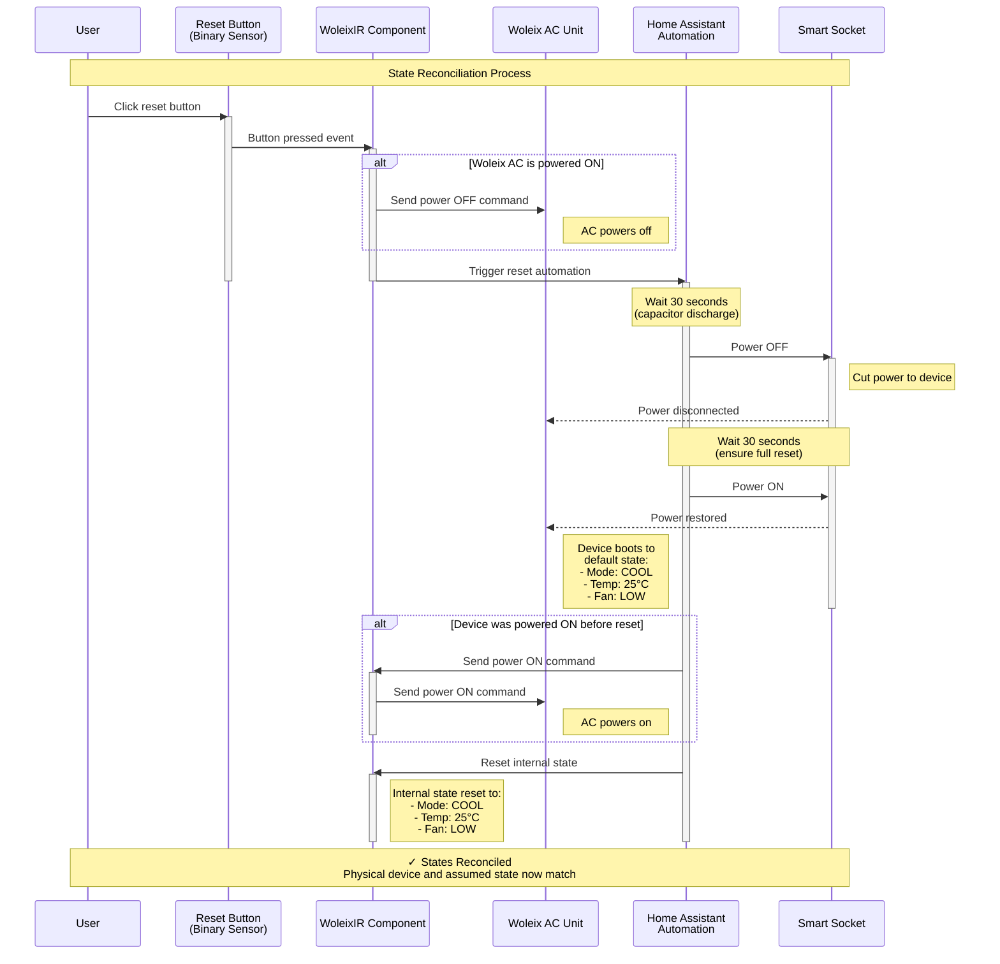

# ESPHome External Components - Woleix Climate IR

Custom ESPHome component for controlling Woleix air conditioners via infrared remote control.

## 📁 Project Structure

```text
esphome-external-components/
├── esphome/
│   └── components/
│       └── climate_ir_woleix/              # Main component directory
│           ├── __init__.py                 # Python configuration interface
│           ├── climate.py                  # ESPHome climate platform
│           ├── climate_ir_woleix.h         # C++ header file
│           ├── climate_ir_woleix.cpp       # C++ implementation
│           ├── woleix_ac_state_machine.h   # State machine header
│           ├── woleix_ac_state_machine.cpp # State machine implementation
│           └── LICENSE                     # Component license
├── tests/                                  # Test suite
│   ├── unit/                               # C++ unit tests
│   │   ├── climate_ir_woleix_test.cpp      # Climate component tests (27 tests)
│   │   ├── woleix_ac_state_machine_test.cpp # State machine tests (26 tests)
│   │   ├── state_mapper_test.cpp           # State mapper tests (19 tests)
│   │   ├── CMakeLists.txt                  # Test build configuration
│   │   ├── run_tests.sh                    # Test execution script
│   │   ├── generate_coverage.sh            # Coverage report generator
│   │   └── mocks/                          # Mock ESPHome headers
│   ├── integration/                        # Integration tests
│   │   ├── test_configs/                   # ESPHome test configurations
│   │   ├── test_runner.py                  # Test orchestration script
│   │   ├── run_tests.sh                    # Integration test runner
│   │   └── docker-compose.yml              # Docker environment
│   └── README.md                           # Testing documentation
├── .vscode/                            # VS Code configuration
│   ├── settings.json                   # Editor settings
│   ├── tasks.json                      # Build tasks
│   ├── launch.json                     # Debug configurations
│   └── c_cpp_properties.json           # C++ IntelliSense config
├── platformio_install_deps_locally.py  # PlatformIO dependency installer
├── prepare_esphome.sh                  # ESPHome setup helper script
├── .venv/                              # Python virtual environment
├── CMakeLists.txt                      # Root CMake configuration
├── .gitignore                          # Git ignore rules
├── .env                                # Environment variables (not in git)
└── README.md                           # This file
```

## 🛠️ Development Setup

### Prerequisites

- **Operating System**: macOS, Linux, or Windows with WSL
- **Git**: For version control
- **Python 3.9+**: For ESPHome development
- **C++ Compiler**: For building and testing
- **CMake 3.16+**: For build system
- **VS Code**: Recommended IDE

## 📖 Component Architecture

The climate_ir_woleix component consists of two main parts:

### Climate IR Component (`climate_ir_woleix.h/cpp`)

- Implements ESPHome's Climate interface
- Handles user interactions and state management
- Integrates with temperature/humidity sensors
- Coordinates IR command transmission
- Supports an optional reset button for state reconciliation

### State Machine (`woleix_ac_state_machine.h/cpp`)

- Manages internal AC state (power, mode, temperature, fan speed)
- Generates optimal command sequences for state transitions
- Provides Pronto hex format IR commands
- Handles mode cycling and temperature adjustments

**Key Features:**

- Power toggle with state reset on power-on
- Mode cycling: COOL → DEHUM → FAN → COOL
- Temperature control (15-30°C, COOL mode only)
- Fan speed toggle (LOW ↔ HIGH)
- Optimized command generation for minimal IR transmissions
- Granular temperature control: Sends individual commands for each degree of change
- Support for humidity sensor integration
- Optional reset button for state reconciliation

**Temperature Control Behavior:**

The temperature control implementation sends multiple commands, one for each degree of change. This approach:

- Mimics the behavior of pressing a physical remote button multiple times
- Ensures compatibility with the AC unit's internal state tracking
- Allows for precise control and feedback
- Is consistent with the granular nature of temperature control compared to other binary or cyclic settings

**State Machine Behavior:**

- Power toggle affects all other states (turning ON resets to defaults)
- Mode cycles through COOL→DEHUM→FAN→COOL in sequence
- Temperature is only adjustable in COOL mode (15-30°C range)
- Fan speed toggles between LOW and HIGH

**Default Settings:**

- Power: ON
- Mode: COOL
- Temperature: 25°C
- Fan Speed: LOW

### 1. Clone the Repository

```bash
git clone https://github.com/ok11/esphome-external-components.git
cd esphome-external-components
```

### 2. Python Development Environment Setup

#### Create Virtual Environment

```bash
# Create .venv directory
python3 -m venv .venv

# Activate virtual environment
# On macOS/Linux/WSL:
source .venv/bin/activate

```

#### Install ESPHome

```bash
# Upgrade pip first
pip install --upgrade pip

# Install ESPHome and dependencies
pip install esphome

# Verify installation
esphome version
```

#### Configure VS Code Python Interpreter

1. Open Command Palette: `Cmd+Shift+P` (macOS) or `Ctrl+Shift+P` (Windows/Linux)
2. Type: `Python: Select Interpreter`
3. Choose: `.venv/bin/python` or `./esphome-external-components/.venv/bin/python`
4. Reload VS Code window if needed

### 3. C++ Development Environment Setup

#### Install Required Tools

**macOS:**

```bash
# Install Xcode Command Line Tools (includes clang/clang++)
xcode-select --install

# Install CMake via Homebrew
brew install cmake

# Install Google Test (optional, for local testing)
brew install googletest
```

**Linux (Ubuntu/Debian) or WSL:**

```bash
# Install build essentials
sudo apt update
sudo apt install build-essential cmake

# Install Google Test
sudo apt install libgtest-dev
cd /usr/src/gtest
sudo cmake CMakeLists.txt
sudo make
sudo cp lib/*.a /usr/lib
```

#### Verify C++ Tools

```bash
# Check compiler
g++ --version
# or
clang++ --version

# Check CMake
cmake --version

# Should see CMake 3.20 or higher
```

### 4. PlatformIO Dependencies (For External Component Development)

The `platformio_install_deps_locally.py` script installs PlatformIO libraries into the ESPHome installation directory, providing stable include and library paths for external component compilation. It is called from `prepare_esphome.sh` before `CMake` steps, so you basically don't bother, but it is of course also possible to call it separately.

#### Why Use This Script?

- **Stable Paths**: Unlike ESPHome's global `platformio_install_deps.py` (which installs to system-wide locations), this script installs dependencies under the ESPHome root directory
- **Predictable Includes**: Ensures consistent library locations for IDE IntelliSense and compilation
- **Development Workflow**: Essential for external component development where you need access to ESPHome's internal dependencies

#### Usage

```bash
# Activate virtual environment first
source .venv/bin/activate

# Install all dependencies from a platformio.ini file
./platformio_install_deps_locally.py /path/to/esphome/platformio.ini

# Ii is also possible to install packages separately (as opposed to the above "everything mentioned in the ini file")
#   -l, --libraries <list of libraries>  Install library dependencies
#   -p, --platforms <list of platforms>  Install platform dependencies
#   -t, --tools     <list of tools>      Install tool dependencies
```

### 5. Building and Testing C++ Code

#### Build Tests

```bash
# Create build directory
mkdir -p build
cd build

# Configure with CMake
cmake ..

# Build the tests
cmake --build .

# Run tests
ctest --output-on-failure

# Or run the test executable directly
./tests/climate_ir_woleix_test
```

#### Alternative: Use Test Script

```bash
# From project root
cd tests
./run_tests.sh
```

### 6. VS Code Configuration

The project includes pre-configured VS Code settings (I tried to keep it portable as much as possible):

- **`.vscode/settings.json`**: Python interpreter, CMake settings
- **`.vscode/tasks.json`**: Build tasks (Cmd+Shift+B)
- **`.vscode/launch.json`**: Debug configurations
- **`.vscode/c_cpp_properties.json`**: C++ IntelliSense configuration

#### Install Recommended VS Code Extensions

1. **Python** (ms-python.python)
2. **C/C++** (ms-vscode.cpptools)
3. **CMake Tools** (ms-vscode.cmake-tools)
4. **ESPHome Snippets** (optional)

## 🚀 Using the Component

### The Key Assumptions about the Hardware

In the essence, my hardware is a combination of

- (Required) **ESP32-C3 Super mini** for the entire control (very cheap on Aliexpress/Temu)
- (Required) An **IR Transmitter** to transmit towards the Woleix
- (Optional, but recommended) **DHT-11** (as the device is intended to be used indoor, DHT-22 measuring negative temperatures would be not required) for indicating current temperature and humidity
- (Optional, but recommended) A **button** component (grounded via a pull-up resistor of 220 Ohm) for reconciling the state

### On the State Reconciliation

Since Woleix has no back channel to the remote, the remote can only operate in "fire-and-forget" mode and must assume device state changes based on the commands it has sent. This state assumption (managed by the `woleix_ac_state_machine` in the component) can be easily broken if:

- IR signals are lost
- The native remote control is used
- Power interruptions occur
- ...

This leads to inconsistency between the assumed state and the actual device state. The Woleix offers no easy way to reset the device, except for:

1. Power off the device
2. Cut power for 30 seconds (to allow internal capacitors to discharge)

After powering on, the device returns to its *default* state:

- **Mode**: COOL
- **Temperature**: 25°C
- **Fan speed** (if then switched to FAN mode): LOW

To maintain synchronization, you need a mechanism to bring your WoleixIR component to the same *default* state. I have automated this at the Home Assistant level by controlling the device through a smart socket. The reconciliation process works as follows:

- The reset button (a `binary_sensor`) is clicked (actually a long press of 3 seconds to avoid accidental resets), which initiates:
  - Sending a power OFF command to Woleix if it is currently on
  - After a 30-second delay (according to the user's manual), a Home Assistant automation switches off the smart socket
  - After another 30-second delay, the smart socket is powered back on
  - If the device was powered on before the reset, it is powered on again
  - The internal (assumed) state is reset to the defaults
- The states are now reconciled

#### Reconciliation Sequence Diagram



### In Your ESPHome Configuration

```yaml
external_components:
  - source: github://ok11/esphome-external-components
    components: [ climate_ir_woleix ]

# Remote transmitter setup
remote_transmitter:
  pin: GPIO20
  carrier_duty_percent: 50%
  id: ir_transmitter

# Temperature and humidity sensor
sensor:
  - platform: dht
    model: DHT11
    pin: GPIO4
    temperature:
      name: "Room Temperature"
      id: room_temp
    humidity:
      name: "Room Humidity"
      id: room_humidity
    update_interval: 60s

# Reset button
binary_sensor:
  - platform: gpio
    id: ac_reset_button
    pin: GPIO5
    filters:
      - delayed_on: 3s
      - delayed_off: 10ms

# Climate control
climate:
  - platform: climate_ir_woleix
    name: "Air Conditioner"
    transmitter_id: ir_transmitter
    sensor: room_temp              # Temperature sensor (required)
    humidity_sensor: room_humidity  # Humidity sensor (optional)
    reset_button: ac_reset_button  # Reset button (optional)
```

## 🧪 Running Tests

### Unit Tests

#### Quick Start

```bash
# Build and run all tests
cd tests/unit
./run_tests.sh

# Generate coverage report
./generate_coverage.sh

# View coverage report
open build/coverage/html/index.html  # macOS
xdg-open build/coverage/html/index.html  # Linux
```

#### Current Test Status

As of the latest update, all 72 unit tests in the test suite are passing:
- **27 tests** in `climate_ir_woleix_test.cpp` (Climate component tests)
- **26 tests** in `woleix_ac_state_machine_test.cpp` (State machine tests)
- **19 tests** in `state_mapper_test.cpp` (State mapper tests)

These tests cover:

1. **Temperature Control**: Verifying that temperature changes are only processed in COOL mode and that the correct number of temperature adjustment commands are sent.

2. **Mode Transitions**: Ensuring that mode changes (e.g., COOL to FAN, DRY to COOL) generate the correct number of mode change commands.

3. **Sensor Integration**: Confirming that temperature and humidity sensor updates are processed correctly and trigger state updates.

4. **Power State Transitions**: Validating the correct handling of power on/off sequences.

5. **Fan Speed Control**: Verifying proper fan speed adjustments across different modes.

6. **Complex State Changes**: Testing scenarios involving multiple parameter changes simultaneously.

7. **State Mapping**: Validating conversions between ESPHome and Woleix state representations.

These passing tests demonstrate the reliability and correctness of the climate control component across various scenarios and edge cases.

**Note:** The component has undergone significant improvements, and all previously failing tests have been resolved. The development team continues to maintain and enhance the test suite to ensure ongoing reliability.

#### Using VSCode Tasks

Press `Cmd+Shift+P` (Mac) or `Ctrl+Shift+P` (Windows/Linux), then:

1. Type "Tasks: Run Task"
2. Select:
   - **"Unit Tests: Run Tests"** - Run tests only
   - **"Unit Tests: Generate Coverage Report"** - Run tests + generate coverage
   - **"Unit Tests: Open Coverage Report"** - Run tests + generate + open report in browser

#### Manual Testing

```bash
cd tests/unit
mkdir -p build && cd build
cmake -DENABLE_COVERAGE=ON ..
cmake --build .
./climate_ir_woleix_test
```

See [tests/unit/README.md](tests/unit/README.md) for detailed testing documentation.

### Linting Python Code

```bash
# Activate virtual environment
source .venv/bin/activate

# Install linting tools
pip install pylint black

# Run pylint
pylint esphome/components/climate_ir_woleix/__init__.py

# Format with black
black esphome/components/climate_ir_woleix/__init__.py
```

## 📝 Development Workflow

### Adding New Features

1. **Identify the Layer**
   - Climate interface changes → `climate_ir_woleix.h/cpp`
   - State management/IR commands → `woleix_ac_state_machine.h/cpp`
   - Configuration options → `__init__.py` and `climate.py`

2. **Update Headers and Implementation**
   - Add method declarations in `.h` files
   - Implement in corresponding `.cpp` files
   - For state machine: add IR commands to `woleix_ac_state_machine.cpp`

3. **Update Python Configuration** (if adding user-facing options)
   - Add configuration parameters to `CONFIG_SCHEMA` in `__init__.py`
   - Add code generation in `to_code()`

4. **Write Tests**
   - Climate interface tests → `tests/unit/climate_ir_woleix_test.cpp`
   - State machine tests → `tests/unit/woleix_ac_state_machine_test.cpp`
   - Aim for high coverage (current: 96.3% line coverage)

5. **Test Locally**

   ```bash
   # Run unit tests
   cd tests/unit && ./run_tests.sh
   
   # Generate coverage report
   cd tests/unit && ./generate_coverage.sh
   
   # Run integration tests
   cd tests/integration && ./run_tests.sh
   
   # Test with real ESPHome config
   esphome compile your-config.yaml
   ```

## 🐛 Troubleshooting

### Python Import Errors

If you see Pylint errors about missing ESPHome imports:

1. Ensure `.venv` is activated
2. Select correct Python interpreter in VS Code
3. Reload VS Code window

### C++ Build Errors

```bash
# Clean build directory
rm -rf build
mkdir build
cd build
cmake ..
cmake --build .
```

### CMake Not Finding Compiler

```bash
# Explicitly set compiler
export CC=gcc
export CXX=g++
cmake ..
```
## Codes

### Pronto

### NEC

speeed:
Address: 0xFB04
Command: 0xF906

Temp+:
0xFA05

Temp-:
0xFE01

Mode:
0xF20D

Power
FB04

Timer FF00

## 📚 Resources

- [ESPHome Documentation](https://esphome.io/)
- [ESPHome External Components Guide](https://esphome.io/components/external_components.html)
- [Climate Component Reference](https://esphome.io/components/climate/index.html)
- [Google Test Documentation](https://google.github.io/googletest/)

## 📄 License

See [LICENSE](esphome/components/climate_ir_woleix/LICENSE) file in the component directory.

## 🤝 Contributing

1. Fork the repository
2. Create a feature branch
3. Make your changes
4. Add/update tests
5. Submit a pull request

## 📧 Contact

- GitHub: [@ok11](https://github.com/ok11)
- Issues: [GitHub Issues](https://github.com/ok11/esphome-external-components/issues)
